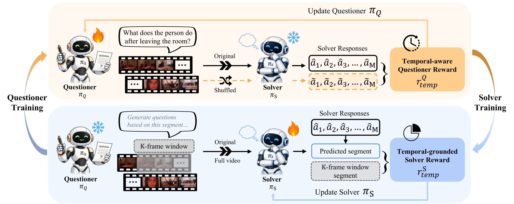

# EvoVid: Temporal-Centric Self-Evolution for Video Large Language Models

[](https://arxiv.org/abs/2605.21931) [](https://arxiv.org/pdf/2605.21931) [](https://huangshiqi128.github.io/EvoVid/)

#### Shiqi Huang<sup>1</sup>, Ziyue Wang<sup>2</sup>, Zhongrong Zuo<sup>2</sup>, Han Qiu<sup>2</sup>, Qi She<sup>2</sup>, Bihan Wen<sup>1*</sup>

<sup>1</sup>School of Electrical and Electronic Engineering, Nanyang Technological University
<sup>2</sup>ByteDance
<sup>*</sup>Corresponding Author

- **Code:** coming soon — this branch (`main`) will host the EvoVid codebase. 

<p align="center">
  
</p>
<p align="center"><em>Overview of EvoVid. Questioner π<sub>Q</sub> and Solver π<sub>S</sub> co-evolve through two temporal-centric rewards.</em></p>

## Abstract

Recent Video Large Language Models (Video-LLMs) have demonstrated strong capabilities in video
reasoning through reinforcement learning (RL). However, existing RL pipelines rely heavily on
human-annotated tasks and solutions, making them costly to scale and fundamentally constrained by
human expertise. Self-evolving frameworks have recently emerged as a promising alternative through
autonomous Questioner–Solver self-play. Unfortunately, these approaches are primarily designed for
static modalities such as text and images, fundamentally failing to capture the temporal dynamics
that are central to video reasoning. In this work, we propose EvoVid, a temporal-centric
self-evolving framework that enables Video-LLMs to improve directly from raw, unannotated videos.
Specifically, we introduce two complementary temporal-centric rewards: a temporal-aware Questioner
reward that encourages temporally dependent question generation through temporal perturbation
sensitivity, and a temporal-grounded Solver reward that provides automatic temporal supervision via
inherent video segment localization. Extensive experiments across four base models and six
benchmarks demonstrate consistent improvements over both base models and existing self-evolving
baselines, achieving competitive performance with supervised methods. These results highlight
temporal-centric self-evolution as an effective and scalable paradigm for video understanding and
reasoning.

## BibTeX
Please consider to cite EvoVid if it helps your research.
```bibtex
@article{huang2026evovid,
  title={EvoVid: Temporal-Centric Self-Evolution for Video Large Language Models},
  author={Huang, Shiqi and Wang, Ziyue and Zuo, Zhongrong and Qiu, Han and She, Qi and Wen, Bihan},
  journal={arXiv preprint arXiv:2605.21931},
  year={2026}
}
```
